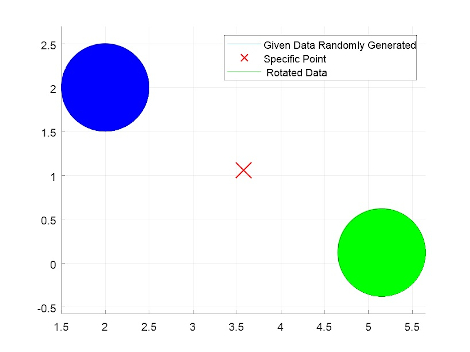
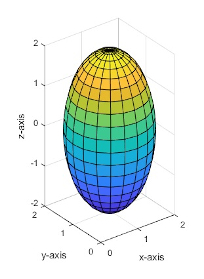
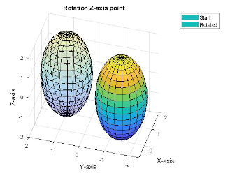
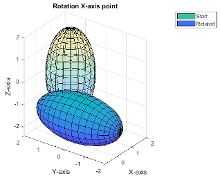
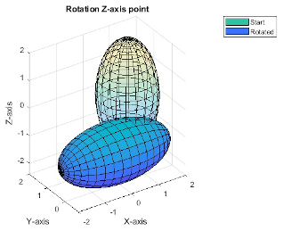

# Rotation of given objects (2D and 3D) around specific point with visualization

## Purpose of project

The goal was to visualize rotation of given 2D and 3D figures. Firstly, we need to implement function that will generate 2D objects like triangle, circle and 3D solid figures like cylinder or sphere. Afterwards our plan is to learn how rotation is done on paper and then using code. Important point is to rotate object with given angle, so user will manage to observe results.

### Software Environment

To run the software you will need a computer with an operating system on which you can run the Matlab environment, or you should pay attention to the free replacement in the form of GNU Octave. Each of the mentioned programs has technical requirements that will allow you to choose the hardware and operating system.

### Flowchart

The startup file will be run.m, which will provide an accessible menu to the user. From the given 2D figures and 3D solids, you can choose any option and observe the results of the program. It is possible to load the angle selected by the user from the keyboard.

## Theoretical Introduction

### 2-dimensional Transform

2D figure rotation allows a matrix of coefficients that consist of trigonometric functions. These mathematical methods take a specific angle 𝜑 in degrees or radians as the parameter. The matrix is as follows:

```
A = [cos(angle) -sin(angle); ...
    sin(angle) cos(angle)];
```

Assuming that we have already generated a specific figure, which consists of the values of X and the numbers Y assigned to these values, respectively. You should prepare the matrix X and Y in the form shown below:

```
points = [x;...
         y];
```

To get the rotated object you need to multiply the two matrices presented above, the result of this operation is a new matrix with new figure values.

However, we need to mention how rotation around specific is done. Let's say we have point, for which we assume x_center and 𝑦_center. In this situation, it is mandatory before the multiplication, points of object have to be subtracted from each value separately from the center of the figure. Then we will rotate around the point (0, 0). After multiplying the matrix, add these values again, so that the result will be a rotated object relative to the given point.

### 3-dimensional Transform

We rotate 3D solids quite similar to 2D figures. The difference is adding to the solid matrix a row with z-axis values and a slightly modified version of the coefficient matrix.

```
% x-axis
X = x;
Y = y * cos(angle) - z * sin(angle);
Z = y * sin(angle) + z * cos(angle);
% y-axis
X = x * cos(angle) + z * sin(angle);
Y = y;
Z = z * cos(angle) - x * sin(angle);
% z-axis
X = x * cos(angle) - y * sin(angle);
Y = x * sin(angle) + y * cos(angle);
Z = z;
```

Particular attention should be paid to the 3D solid matrix. The inline method of the Matlab surf environment was used to draw these objects. To use this method, prepare the 𝑥, 𝑦, 𝑧 values appropriately.

Arrays 𝑥 and 𝑦 must simply be duplicated by lines. The only difference is the matrix 𝑧, whose upper row is to be a constant value 𝐻, it is the height of the solid, while the bottom row is full of zeros.

## Tests

### 2D rotation example

Circle rotated 180 degrees:

<p align="center">
  
</p>

### 3D rotation example

We start by default with any position of the cylinder or sphere. Then it was rotated relative to the z axis by 235 degrees, then 90 degrees relative to the x axis, while at the end 90 degrees z:

<p align="center">
  
</p>

<p align="center">
  
</p>

<p align="center">
  
</p>

<p align="center">
  
</p>

## Summary

The purpose of this work was to implement the correct rotation method for 2D figures and 3D solids with visualization. It includes a program that allows the user to choose the element on which I would like to rotate and the ability to choose the angle. By changing the parameters in the code, we can also modify object elements such as radius, height.

## Author

Mateusz Rzeczyca

Student - AGH University of Science and Technology

rzeczyca@student.agh.edu.pl

Cracow, Poland

9.02.2020

## License

This project is licensed under the GNU GPL3 License - see the LICENSE.md file for details